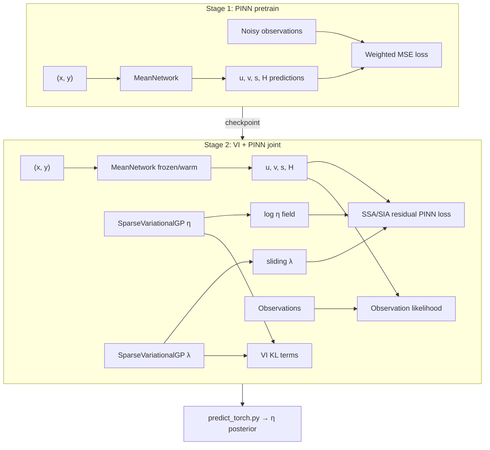

# Archive: VI + PINN (PyTorch)

Legacy **Physics-Informed Neural Network (PINN) + Variational Inference (VI)** pipeline for inferring ice-sheet fields from observations. This is the full PyTorch implementation; the active project also has a lightweight numpy/scipy prototype in `scripts/vi_viscosity_model.py` for test NPZ bundles.

## Two-stage training (required order)

```
Stage 1 — PINN pretrain          Stage 2 — VI joint train
────────────────────────         ─────────────────────────
pretrain_solution_torch.py  →    train_torch.py
MeanNetwork only                 JointModel (MeanNetwork + VGPs)
Outputs: u, v, s, h              Output: viscosity η (and sliding λ)
Checkpoint → torch_pretrain/     Checkpoint → torch_joint/
```

**You must run Stage 1 before Stage 2.** `train_torch.py` loads the pretrained `MeanNetwork` checkpoint and refuses to start (by default) if it is missing.

### Stage 1 — PINN pretrain (velocity & thickness)

**Script:** `pretrain_solution_torch.py`  
**Model:** `MeanNetwork` in `models_torch.py`

Coordinate-only network: $(x, y) \to (\hat u, \hat v, \hat s, \hat H)$.

- **Inputs:** grid coordinates only (not observations)
- **Targets:** observed $u$, $v$, $s$, $H$ from the snapshot (weighted MSE)
- **Loss:** observation fit only (no physics residual yet)
- **Checkpoint:** `checkpoints/torch_pretrain/` (default `model_best`)

```bash
python pretrain_solution_torch.py run_torch.cfg
# or on DSI cluster:
srun python pretrain_solution_torch.py run_torch.cfg
```

### Stage 2 — VI joint train (viscosity)

**Script:** `train_torch.py`  
**Models:** `JointModel`, `SparseVariationalGP` in `models_torch.py`

Loads frozen/warm-started `MeanNetwork` from Stage 1, then trains:

| Component | Role |
|-----------|------|
| `MeanNetwork` | PINN mean field for $u, v, s, H$ (from coordinates) |
| `SparseVariationalGP` (`vgp_eta`) | Variational posterior over **log-viscosity** $\log\eta$ |
| `SparseVariationalGP` (`vgp_lambda`) | Variational posterior over sliding fraction $\lambda$ |
| `JointModel` | Combines PINN physics residuals + VI ELBO |

**Loss terms (joint):**

1. **Observation likelihood** — fit noisy $u$, $v$, $s$, $H$ (same as pretrain)
2. **Physics (PINN) residual** — SSA or SIA PDE residuals via autograd (`_physics_nll_ssa` / `_physics_nll_sia` in `JointModel`)
3. **VI KL** — sparse GP KL on inducing points for $\eta$ and $\lambda$

Physics approximation is set in config: `train.physics_approximation = 'SSA'` or `'SIA'`.

```bash
python train_torch.py run_torch.cfg
```

`train_torch.py` verifies the loaded pretrain checkpoint matches expected observation loss before joint training begins (`verify_pretrain_load`).

### Inference

**Script:** `predict_torch.py`

Loads joint checkpoint, draws VI posterior samples for $\eta$ (viscosity) and writes HDF5 output (`predict.output_file`).

```bash
python predict_torch.py run_torch.cfg
```

---

## File map

| File | Purpose |
|------|---------|
| `models_torch.py` | **Core VI + PINN code** — `MeanNetwork`, `SparseVariationalGP`, `JointModel`, SSA/SIA physics residuals |
| `train_torch.py` | **Stage 2** — joint VI training, loads pretrain checkpoint |
| `pretrain_solution_torch.py` | **Stage 1** — PINN pretrain for $u,v,s,h$ |
| `predict_torch.py` | Posterior sampling and viscosity output |
| `utilities_torch.py` | Config parser, datasets, normalization, Slurm/DDP helpers |

---

## Architecture summary



---

## Config

Scripts expect a config file (e.g. `run_torch.cfg`) parsed by `utilities_torch.py`. Key sections:

| Section | Controls |
|---------|----------|
| `[pretrain]` | Stage 1 epochs, lr, checkpoint dir |
| `[train]` | Stage 2 epochs, physics batch size, `meannet_checkdir`, SSA/SIA |
| `[prior]` | GP inducing points, $\eta$ bounds, length scales |
| `[likelihood]` | Observation and residual noise scales |
| `[predict]` | Posterior sample count, output HDF5 path |
| `[torch]` | Device, DDP backend, workers |

Default paths are embedded in `utilities_torch.py` (`DEFAULT_CONFIG`).

---

## Relation to this repository

| Component | Location |
|-----------|----------|
| Spin-up ground truth (test/production NPZ) | `outputs/spinup/`, `scripts/prep_vi_dataset.py` |
| Lightweight VI (surrogate, no PyTorch) | `scripts/vi_viscosity_model.py`, `notebooks/learning/train_vi_viscosity_test.ipynb` |
| Full VI + PINN (this archive) | `Archive/*.py` |
| icepack SSA reference | `docs/icepack_ssa_equations.md` |

To run this archive on DSI cluster data, prepare a `run_torch.cfg` pointing at a VI bundle or spin-up snapshot, run **pretrain → train → predict** in order.

---

## Dependencies

- PyTorch (with optional CUDA)
- NumPy
- h5py (prediction output)
- MPI/Slurm for multi-GPU (`torchrun`, `srun`)

Not included in the main repo `env/firedrake-conda` environment — use a separate PyTorch env on the cluster.
