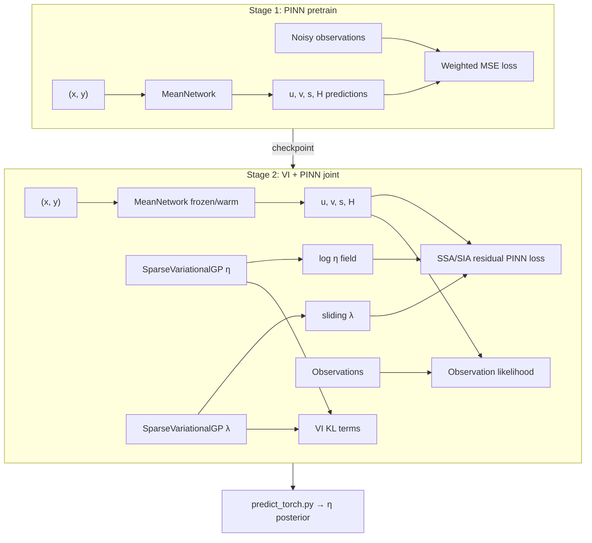

# Archive: VI + PINN (PyTorch)

Legacy **Physics-Informed Neural Network (PINN) + Variational Inference (VI)** pipeline for inferring ice-sheet fields from observations. This is the full PyTorch implementation; the active project also has a lightweight numpy/scipy prototype in `scripts/vi_viscosity_model.py` for test NPZ bundles.

## Two-stage training (required order)

```
Stage 1 — PINN pretrain          Stage 2 — VI joint train
────────────────────────         ─────────────────────────
pretrain_solution_torch.py  →    train_torch.py
MeanNetwork only                 JointModel (MeanNetwork + VGPs)
Outputs: u, v, s, h              Output: viscosity η (and sliding λ)
Checkpoint → torch_pretrain/     Checkpoint → torch_joint/
```

**You must run Stage 1 before Stage 2.** `train_torch.py` loads the pretrained `MeanNetwork` checkpoint and refuses to start (by default) if it is missing.

### Stage 1 — PINN pretrain (velocity & thickness)

**Script:** `pretrain_solution_torch.py`  
**Model:** `MeanNetwork` in `models_torch.py`

Coordinate-only network: $(x, y) \to (\hat u, \hat v, \hat s, \hat H)$.

- **Inputs:** grid coordinates only (not observations)
- **Targets:** observed $u$, $v$, $s$, $H$ from the snapshot (weighted MSE)
- **Loss:** observation fit only (no physics residual yet)
- **Checkpoint:** `checkpoints/torch_pretrain/` (default `model_best`)

```bash
python pretrain_solution_torch.py run_torch.cfg
# or on DSI cluster:
srun python pretrain_solution_torch.py run_torch.cfg
```

### Stage 2 — VI joint train (viscosity)

**Script:** `train_torch.py`  
**Models:** `JointModel`, `SparseVariationalGP` in `models_torch.py`

Loads frozen/warm-started `MeanNetwork` from Stage 1, then trains:

| Component | Role |
|-----------|------|
| `MeanNetwork` | PINN mean field for $u, v, s, H$ (from coordinates) |
| `SparseVariationalGP` (`vgp_eta`) | Variational posterior over **log-viscosity** $\log\eta$ |
| `SparseVariationalGP` (`vgp_lambda`) | Variational posterior over sliding fraction $\lambda$ |
| `JointModel` | Combines PINN physics residuals + VI ELBO |

**Loss terms (joint):**

1. **Observation likelihood** — fit noisy $u$, $v$, $s$, $H$ (same as pretrain)
2. **Physics (PINN) residual** — SSA or SIA PDE residuals via autograd (`_physics_nll_ssa` / `_physics_nll_sia` in `JointModel`)
3. **VI KL** — sparse GP KL on inducing points for $\eta$ and $\lambda$

Physics approximation is set in config: `train.physics_approximation = 'SSA'` or `'SIA'`.

**SSA physics (CHANGED):** `_physics_nll_ssa` in `models_torch.py` now matches the icepack/spin-up formulation:
- icepack units (m, yr, MPa)
- Glen membrane stress `M = 2μ(ε + tr(ε)I)` with `μ = η` (inferred) or `μ_Glen(A, ε)`
- spin-up plastic basal law with fixed `C` from `cfg_json` (λ GP is not used in SSA residuals)
- continuity residual optional (`prior.ssa_enforce_continuity`, default `False`)

Sections marked `# CHANGED` in `models_torch.py` and `utilities_torch.py` document every alteration from the original VI SSA.

```bash
python train_torch.py run_torch.cfg
```

`train_torch.py` verifies the loaded pretrain checkpoint matches expected observation loss before joint training begins (`verify_pretrain_load`).

### Inference

**Script:** `predict_torch.py`

Loads joint checkpoint, draws VI posterior samples for $\eta$ (viscosity) and writes HDF5 output (`predict.output_file`).

```bash
python predict_torch.py run_torch.cfg
```

---

## File map

| File | Purpose |
|------|---------|
| `models_torch.py` | **Core VI + PINN code** — `MeanNetwork`, `SparseVariationalGP`, `JointModel`, SSA/SIA physics residuals |
| `train_torch.py` | **Stage 2** — joint VI training, loads pretrain checkpoint |
| `pretrain_solution_torch.py` | **Stage 1** — PINN pretrain for $u,v,s,h$ |
| `predict_torch.py` | Posterior sampling and viscosity output |
| `utilities_torch.py` | Config parser, datasets, normalization, Slurm/DDP helpers |

---

## Architecture summary



---

## Config

Scripts expect a config file (e.g. `run_torch.cfg`) parsed by `utilities_torch.py`. Key sections:

| Section | Controls |
|---------|----------|
| `[pretrain]` | Stage 1 epochs, lr, checkpoint dir |
| `[train]` | Stage 2 epochs, physics batch size, `meannet_checkdir`, SSA/SIA |
| `[prior]` | GP inducing points, $\eta$ bounds, length scales |
| `[likelihood]` | Observation and residual noise scales |
| `[predict]` | Posterior sample count, output HDF5 path |
| `[torch]` | Device, DDP backend, workers |

Default paths are embedded in `utilities_torch.py` (`DEFAULT_CONFIG`).

**Production more_sliding:** `run_torch.cfg` points at  
`outputs/spinup/production/more_sliding/SteadyState_more_sliding_10500yr_ramp4000_1refine_grid.npz`  
and loads `C=0.001`, `A=20` from `cfg_json` automatically.

---

## DSI cluster (Slurm)

See [`slurm/README.md`](slurm/README.md) for batch submission on the UChicago DSI cluster:

```bash
cd Archive
mkdir -p logs/slurm
sbatch slurm/vi_pretrain_more_sliding.sbatch
sbatch slurm/vi_train_more_sliding.sbatch   # after pretrain
```

Jobs use `--signal=B:USR1@300 --requeue` and atomic checkpoints for preemption-safe overnight runs.

---

## Training plots (PINN + VI)

During **pretrain** and **joint train**, rank 0 writes one CSV row per epoch and refreshes PNG diagnostics every `plot_every` epochs (default `25`; set `0` to disable in-loop plots).

| Stage | Metrics CSV | Figures |
|-------|-------------|---------|
| Pretrain | `logs/metrics_pretrain_<logfile>.csv` | `logs/figures/pretrain_<logfile>/` |
| Joint | `logs/metrics_joint_<logfile>.csv` | `logs/figures/joint_<logfile>/` |

**Pretrain plots:** $\log_{10}$(total & validation loss), data fit, per-field components.

**Joint plots:** $\log_{10}$(total ELBO & validation), data loss, PDE momentum residual, BC/continuity (when `ssa_enforce_continuity=True`).

Regenerate plots anytime (e.g. on the login node while a job runs):

```bash
cd Archive
python plot_training.py run_torch.cfg --stage all
python plot_training.py run_torch.cfg --stage joint
```

**Jupyter notebook:** [`notebooks/analysis/plot_vi_training.ipynb`](../notebooks/analysis/plot_vi_training.ipynb) — training loss curves.

**Posterior validation:** [`notebooks/analysis/validate_vi_posterior_more_sliding.ipynb`](../notebooks/analysis/validate_vi_posterior_more_sliding.ipynb) — η vs spin-up NPZ, error maps, velocity check.

Optional overrides in `run_torch.cfg`: `plot_every`, `metrics_csv`, `plot_dir` under `[pretrain]` or `[train]`.

---

## η-focused joint training (recommended after biased VI)

The previous more_sliding joint run minimized the ELBO mainly by retuning PINN state \((u,v,s,H)\), leaving η biased (~10× too low, near-zero correlation). Causes:

- mean_net freeze was too short / skipped on resume (absolute epoch check)
- equal LRs for mean_net and `vgp_eta`
- soft SSA residual noise (`ssa_*_std=5`) → physics stuck at Gaussian constant floor
- no anchor to the pretrained PINN state
- unused λ KL under SSA

`run_torch.cfg` now defaults to a **spatial-η recovery** recipe (after mean-η stability was achieved):

| Knob | Recommended | Role |
|------|-------------|------|
| `freeze_mean_net_epochs` | 800 | Longer VGP-only phase before PINN can absorb residuals |
| `mean_net_lr` / `vgp_eta_lr` | `1e-5` / `5e-4` | Prefer η updates; higher VGP LR while frozen |
| `data_scale` / `phys_scale` / `state_reg_scale` | `1` / `3` / `1` | Slightly stronger physics after milder η prior |
| `eta_prior_scale` / `eta_prior_std` | `0.2` / `1` | Anchor mean near `eta_init` without flattening spatial η |
| `eta_min` | `1.0` | Hard floor against η→0 |
| `ssa_rx_std` / `ssa_ry_std` | `0.08` | Residual-aware physics |
| `num_inducing_x/y` + `inducing_placement` | `28` / `ice_fps` | More inducing capacity for spatial structure |
| `mean_net_optimizer` / `vgp_optimizer` | `adam` / `adam` | Split optimizers (independent LR / clip / schedule) |
| `mean_net_optimizer_after_unfreeze` | `lbfgs` | Optional PINN fine-tune after freeze ends |
| `vgp_steps_per_mean_step` | `8` | Alternating: N VGP steps per 1 PINN step (after unfreeze) |
| `mean_net_grad_clip` / `vgp_grad_clip` | `1` / `5` | Per-module clipping |
| `kl_eta` / `kl_lambda` | `0.5` / `0` | Stronger η KL; λ unused in SSA |
| `lr_scheduler` | `cosine` | Applied independently to each Adam optimizer |
| `eta_eval_every` | `10` | Log η RMSE / bias / corr vs spin-up viscosity |
| `grad_eta_warn_ratio` | `100` | Warn if unfrozen mean_net grads drown `vgp_eta` |
| `restore` | `False` | Fresh joint train (inducing / optimizer layout changed) |

**Important:** A prior run recovered unbiased mean η (`log10_bias≈0`) but **flat** spatial η (`r≈0`) because after unfreeze the PINN grads dominated (~6000×). Split optimizers + alternating VGP-heavy updates aim to let the VGP explain remaining PDE mismatch. Changing inducing size changes VGP shapes → start fresh (`restore=False`); archive flat-η checkpoints before resubmitting.

Logs / CSV now include per-epoch: ELBO terms (data / phys / KL / η prior / state_reg), per-optimizer LRs, VGP vs PINN update counts, module grad norms, `grad_ratio` (`mean_net/vgp_eta`), and `eta_vs_ref` metrics when viscosity is present in the NPZ.

---

## Relation to this repository

| Component | Location |
|-----------|----------|
| Spin-up ground truth (test/production NPZ) | `outputs/spinup/`, `scripts/prep_vi_dataset.py` |
| Lightweight VI (surrogate, no PyTorch) | `scripts/vi_viscosity_model.py`, `notebooks/learning/train_vi_viscosity_test.ipynb` |
| Full VI + PINN (this archive) | `Archive/*.py` |
| icepack SSA reference | `docs/icepack_ssa_equations.md` |

To run this archive on DSI cluster data, prepare a `run_torch.cfg` pointing at a VI bundle or spin-up snapshot, run **pretrain → train → predict** in order.

---

## Dependencies

- PyTorch (with optional CUDA)
- NumPy
- h5py (prediction output)
- MPI/Slurm for multi-GPU (`torchrun`, `srun`)

Not included in the main repo `env/firedrake-conda` environment — use a separate PyTorch env on the cluster.
